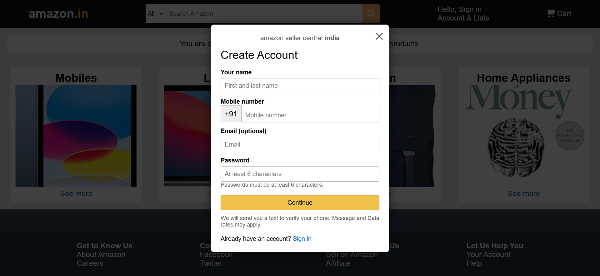
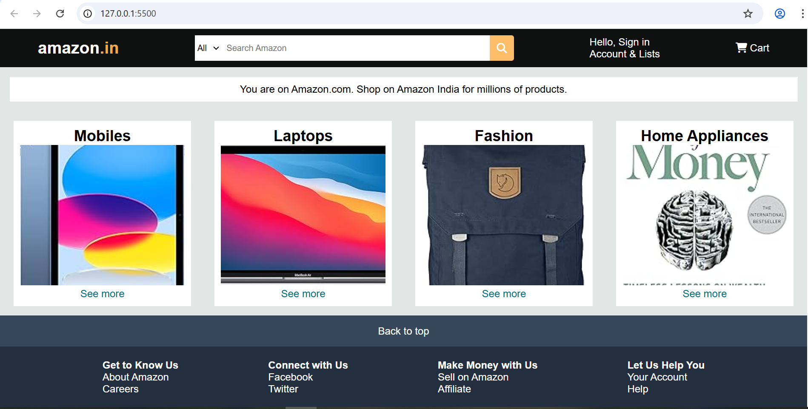
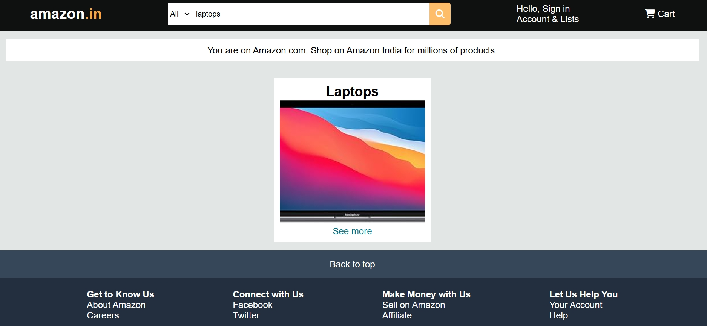
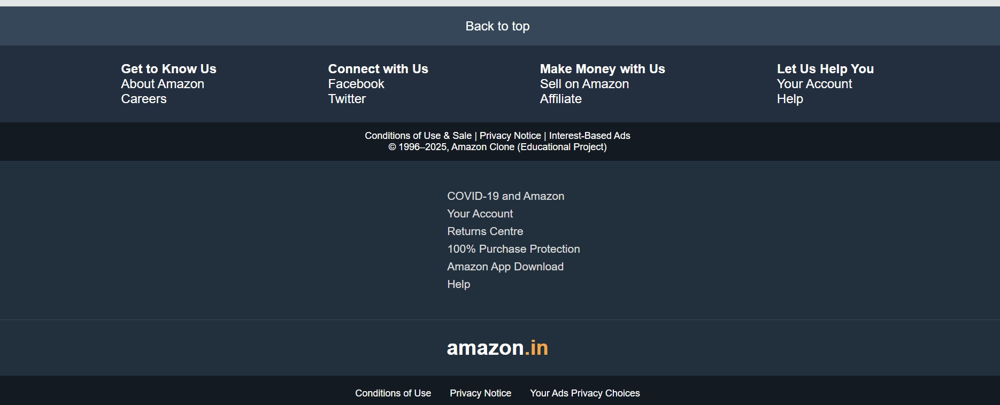

The **Amazon Clone** is a demonstration web application designed to mimic the user interface and basic functionality of the Amazon platform. It recreates the familiar shopping experience with a clean layout, intuitive navigation, and simple interactions — perfect for learning or showcasing web development skills.

## 🌟 Features
- 🔐 **Login & Signup Popup** — appears when the site is opened, simulating a real e‑commerce flow.  
- 🛍️ **Product Grid Layout** — items displayed in an organized grid, similar to Amazon’s listings.  
- 🔎 **Search Bar** — allows users to quickly look for products.  
- 🛒 **Add to Cart** — select items and simulate a shopping experience.  
- 🎨 **Amazon‑style UI** — structured layouts, clean sections, and easy navigation. 

## 📂 Tech Stack
- **Frontend:** HTML, CSS, JavaScript  
- **Design:** Clean, structured layout inspired by Amazon’s interface  
- **Focus:** Beginner‑friendly, showcasing core e‑commerce concepts

### signin Page

### logo 

### Home Page

### search item

### Bottom Page

